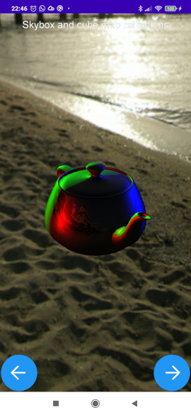
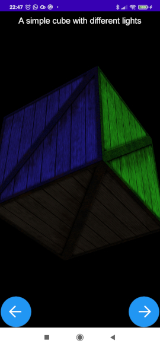

jmini3d-demo
============

https://travis-ci.org/the3deers/jmini3d-demo-android.svg?branch=master

Minimalistic OpenGL2 3d engine for Android.
This is a fork of https://github.com/mobialia/jmini3d

This repo contains only the android demo.
Compiled using Android Studio 4.0 and Gradle 6.1.1

For documentation about the engine please visit original repository.


Features
========

* Optimized for speed and smooth rendering
* Extremely fast model loading (converts OBJ models to Java classes)
* Phong lighting model with multiple lights (Ambient/Point/Directional), no attenuation with the distance
* Reflections with cube environment mapping
* HUD and 2d sprites support
* Normal maps
* Vertex colors
* Bitmap font support
* Ready to use in Virtual Reality (VR) projects for Google Cardboard, there is a sample in https://github.com/mobialia/jmini3d-vr-demo


Screenshots
===========





Try it
======

You can install the application in either of these ways:

  * APK: [app-debug.apk](demo-android/app/build/outputs/apk/debug/app-debug.apk)
  * Source code: clone the repository, compile with gradle and install with adb

```
    cd demo-android
    export ANDROID_HOME=/home/$USER/Android/Sdk
    ./gradlew assembleDebug
    adb install -r app/build/outputs/apk/debug/app-debug.apk

```


Licenses
========

It's released under the MIT License, so feel free to use it anywhere.

The cube texture in the demos is CC licensed from Humus http://www.humus.name
